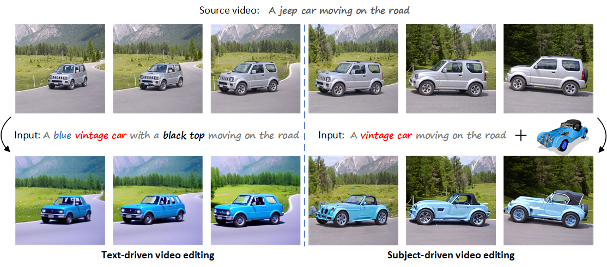
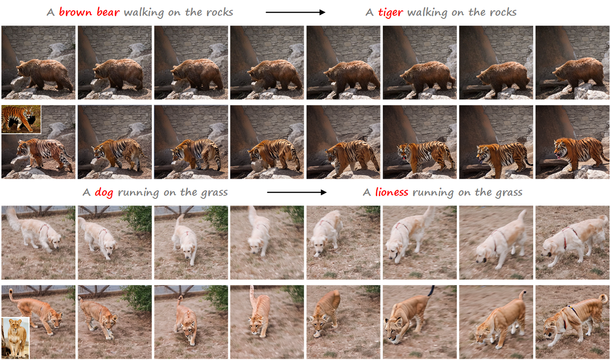
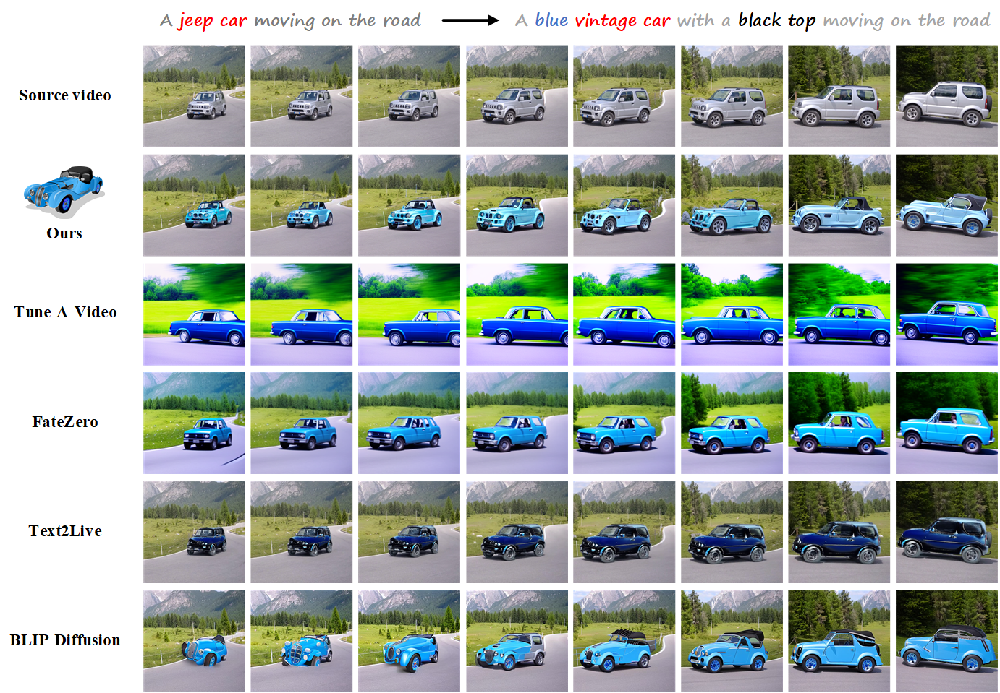
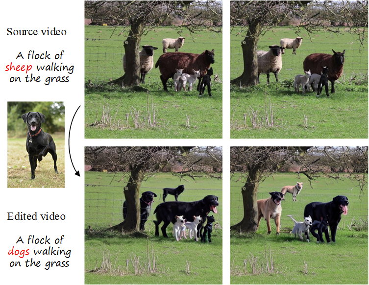
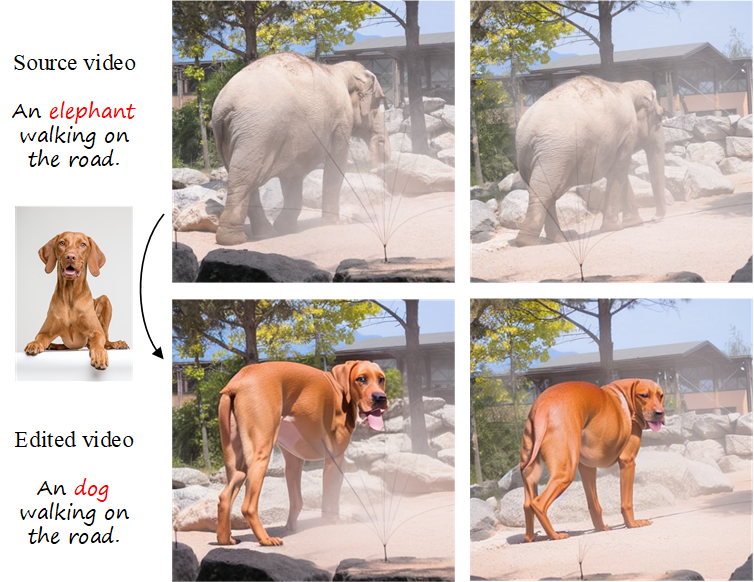

# Cut-and-Paste
A novel framework termed Cut-and-Paste for subject-driven video editing

**Text-driven video editing vs. Subject-driven video editing (ours).** For precise control of edited contents, text-driven
video editing methods require a cumbersome text input to describe various aspects of the object’s properties. Nevertheless, the
results are always unsatisfactory and the background usually changes as well (Left). In contrast, we propose a novel framework
termed Cut-and-Paste for subject-driven video editing, which leverages the reference image as supplementary input and then
just needs a simple text prompt, which achieves fine-grained semantic generation and meanwhile preserves the background of
source video better with attention control (Right).

#### Performance

#### Comparision

#### Limitation

- **editing multiple objects**

- **editing on a large scale**

